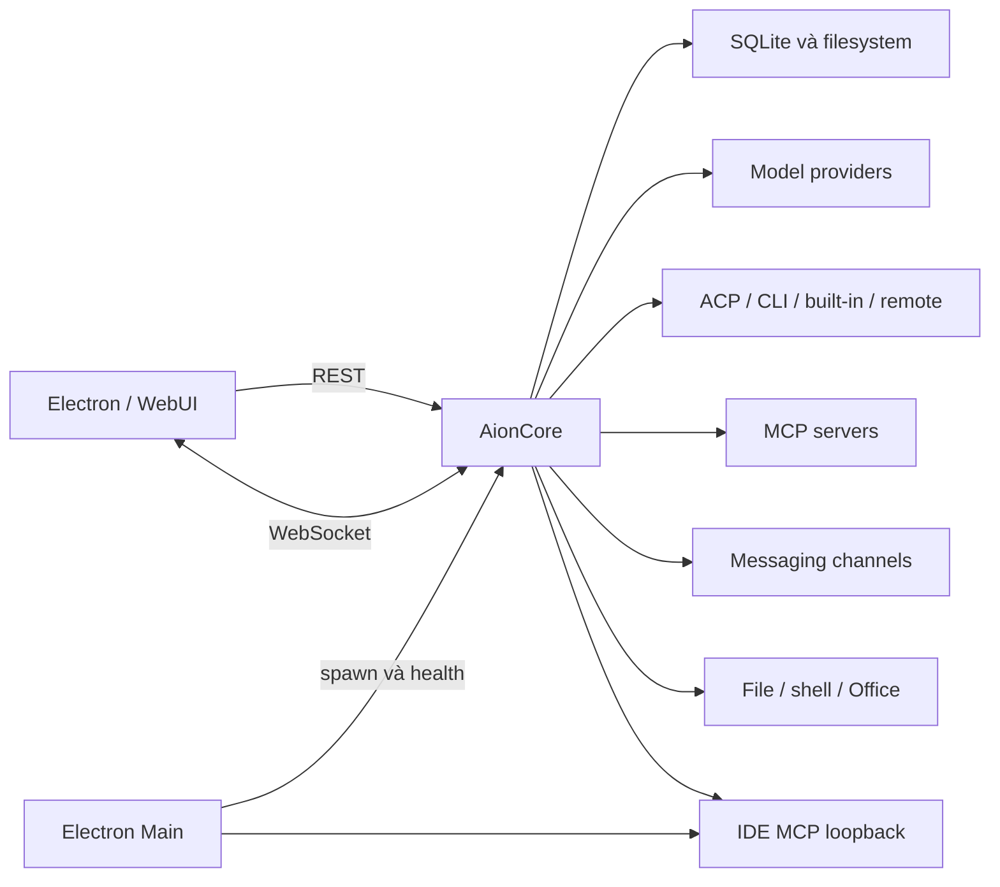
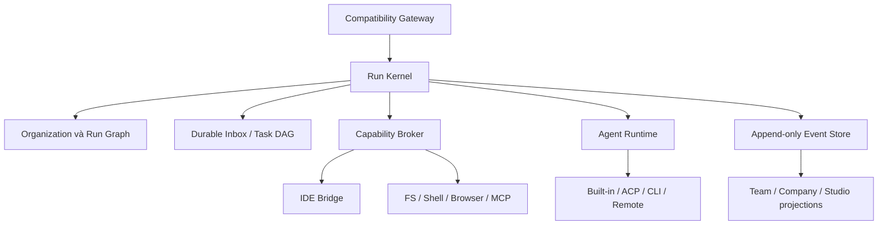

# Báo cáo nghiên cứu AionCore và thiết kế core thế hệ mới

> Phạm vi: `resources/bundled-aioncore/win32-x64/aioncore.exe` trong AionUi 2.1.16.  
> Ngày khảo sát: 2026-07-15.

## 1. Kết luận điều hành

AionCore không chỉ là agent runner. Đây là backend Rust đảm nhiệm REST, WebSocket, SQLite, conversations, providers, MCP, cron, Team, file, shell, Office, channels và nhiều agent backend.

Electron spawn core trên cổng loopback ngẫu nhiên, truyền data/work/log directories, chờ `GET /health`, rồi giao tiếp qua `/api/*` và `/ws`. Vì vậy core thay thế phải tương thích protocol, persistence và lifecycle, không chỉ vòng lặp model-tool.

Source AionCore công khai tại [VNDT1625/OmniAgent](https://github.com/VNDT1625/OmniAgent). Binary cục bộ là `v0.1.16`, trong khi upstream mới nhất lúc khảo sát là [v0.1.47](https://github.com/VNDT1625/OmniAgent/releases/tag/v0.1.47).

Khuyến nghị là fork source, đóng băng contract, dựng compatibility shell, rồi thay dần nội bộ bằng event-sourced run kernel, durable inbox và capability broker. Team và Company nên trở thành hai cấu hình của cùng orchestration engine.

Bốn hướng để vượt core hiện tại:

- subagent nhận IDE context và công cụ thật;
- mailbox có ack/retry, không mất việc khi crash;
- semantic event mô tả agent đang làm bước nào;
- quyền công cụ cấp theo scope và lease.

## 2. Bằng chứng

Báo cáo đối chiếu artifact cục bộ, launcher và REST/WS bridge, schema SQLite, code Team/Company/IDE, source chính thức đúng tag [v0.1.16](https://github.com/VNDT1625/OmniAgent/tree/v0.1.16) và metadata GitHub release.

Kết luận dựa trên source đúng tag hoặc code gọi trực tiếp có độ tin cậy cao. Kết luận từ schema và chuỗi binary có độ tin cậy trung bình.

## 3. Nhận dạng binary

| Thuộc tính     | Kết quả                                                            |
| -------------- | ------------------------------------------------------------------ |
| Version        | `aioncore 0.1.16`                                                  |
| Kích thước x64 | 98.680.320 byte                                                    |
| SHA-256 x64    | `960C8E4F2F8CA22E4D74E3B4AB7DD3F868CE4BC260B491134BF13D3FB20B2ADE` |
| SHA-256 arm64  | `F1009155F1C1705EFD2C74176F572C5EC40D00D3F173EE64F0FA724D1966E2EE` |
| PE machine     | `0x8664` AMD64, PE32+                                              |
| PE timestamp   | 2026-05-29 14:04:27 UTC                                            |
| Authenticode   | Không ký                                                           |
| Release commit | `36938554bc4dca870141d37fc0ac63e2038ff4c0`                         |
| Stack          | Rust, Tokio, Axum, SQLx, rustls                                    |

CLI hỗ trợ server, `mcp-bridge`, `mcp-guide-stdio`, `mcp-team-stdio` và `doctor`. Core mới nên ký artifact, xuất SBOM và xác minh signature/checksum trước khi spawn.

## 4. Core kết nối với những gì



### Electron và WebUI

[backend-launcher.ts](packages/web-host/src/backend-launcher.ts) spawn binary với port, data-dir, work-dir, log-dir, app-version và local mode. Launcher poll health mỗi 200 ms tối đa 30 giây, giữ tail stdout/stderr, kill process tree và giới hạn restart ba lần trong 60 giây.

WebUI dùng `@aionui/web-host` reverse proxy `/api/*` và upgrade `/ws`.

### Model và agent runtime

Core giữ providers trong SQLite và mã hóa API key. Source có adapter OpenAI-compatible, Anthropic, AWS Bedrock và Vertex. `aionui-ai-agent` quản lý ACP, Aionrs, OpenClaw, Nanobot, remote agent và custom CLI.

Agent factory inject provider, skills, MCP snapshot, workspace và policy. ACP session được lưu để resume/reconcile. Stream từng backend được chuẩn hóa thành text, thought, tool use, permission, finish và error.

### MCP và IDE

Core quản lý MCP qua stdio, SSE và streamable HTTP; đồng bộ cấu hình sang CLI; inject MCP theo session; chạy Team Guide MCP và Team MCP.

IDE không nằm trong Rust core. [registerIdeMcp.ts](packages/desktop/src/process/ide/mcp/registerIdeMcp.ts) host IDE tools trong Electron Main qua loopback SSE, rồi đăng ký endpoint vào MCP catalog với `enabled: false`.

Đây là nguyên nhân subagent thiếu IDE: spawn spec mang backend/model/workspace nhưng không tự động mang live editor state, selection, diagnostics, open buffers hoặc IDE capability grant.

## 5. Module và API

| Nhóm          | Crate                                              |
| ------------- | -------------------------------------------------- |
| Bootstrap/API | `aionui-app`                                       |
| Agent runtime | `aionui-ai-agent`, `aionrs`                        |
| Conversation  | `aionui-conversation`                              |
| Multi-agent   | `aionui-team`                                      |
| Realtime      | `aionui-realtime`                                  |
| Persistence   | `aionui-db`                                        |
| Security      | `aionui-auth`                                      |
| Tools         | `aionui-file`, `aionui-shell`, `aionui-office`     |
| Integrations  | `aionui-mcp`, `aionui-channel`, `aionui-extension` |
| Automation    | `aionui-cron`                                      |

API gồm auth, providers, agents, conversations, teams, MCP, filesystem, skills, extensions, cron, channels, Office, shell, STT và system.

WebSocket envelope chính:

```json
{ "name": "turn.completed", "data": { "state": "finished" } }
```

Một số client chấp nhận cả `name/data` và `event/payload`, cho thấy protocol đã trôi. Core mới cần version, event ID, aggregate ID, sequence, causation ID và timestamp.

## 6. Persistence

Các bảng quan trọng gồm users, settings, providers, agent metadata, ACP sessions, conversations, messages, artifacts, MCP servers, OAuth tokens, cron jobs, teams, mailbox và team tasks.

Điểm yếu:

- mailbox chỉ có cờ `read`, không có ack/nack hoặc visibility timeout;
- agent chết sau khi message được đánh dấu read có thể làm mất việc;
- task dependency là JSON, chưa bảo đảm DAG;
- scheduler/session quan trọng sống trong RAM;
- JSON columns làm invariant và migration khó hơn.

Desktop core mới vẫn có thể dùng SQLite nhưng cần append-only event log, transactional inbox/outbox, leases và idempotency keys.

## 7. Team và Company

Team có leader và agent slots; mỗi slot gắn conversation riêng. Session chứa scheduler, mailbox, task board và MCP endpoint. Tool surface gồm send message, spawn, task CRUD, members, rename, shutdown, list models và describe assistant.

User-to-agent đi qua conversation API. Agent-to-agent đi qua mailbox. Điểm mạnh là context độc lập, nhiều backend/model, dynamic spawn và MCP. Điểm yếu là durable delivery, in-memory state, task DAG và semantic progress.

Company chủ yếu nằm trong AionUi TypeScript:

- `packages/desktop/src/process/company/`;
- `packages/desktop/src/renderer/pages/company/pipeline/`.

[roleExecutor.ts](packages/desktop/src/renderer/pages/company/pipeline/roleExecutor.ts) tạo hoặc reuse conversation, gọi `sendMessage`, rồi chờ `turn.completed`. Vì vậy hiện có hai engine:

- Team là Rust scheduler/mailbox/MCP;
- Company là TypeScript orchestration trên nhiều conversations.

Nên hợp nhất thành `OrganizationGraph + RunGraph`: Team là graph phẳng; Company là graph nhiều tầng có reporting và approval; UI chỉ là projection khác nhau.

## 8. Bảo mật

Điểm tốt: bind loopback mặc định, remote mode có JWT/CSRF/bcrypt, API key được mã hóa, Team MCP có token, request body có giới hạn và process tree được cleanup.

Rủi ro:

1. `--local` bỏ JWT và cho CORS mọi origin.
2. Một process có quyền file, shell, secret, channel và agent.
3. Executable con chưa ký.
4. Attach nhầm MCP có thể cấp quyền vượt nhiệm vụ.
5. Secret và business state chung database.
6. Local và remote dùng chung router lớn.
7. Event broadcast chưa scope rõ theo tenant/run.

Core mới cần local session token, origin allowlist, capability token ngắn hạn, per-run scope, audit log, secret vault riêng, sandbox, signed release và SBOM.

## 9. Kiến trúc core mới



### Run Kernel

Quản lý `Run`, `AgentInstance`, `Step`, `Task`, `Artifact` và `Approval`. Mọi transition ghi event trước khi publish; state được rebuild từ snapshot cộng event log.

### Durable Inbox

Message đi qua `ready -> leased -> acked`, có lease deadline, attempt và idempotency key. Agent chết thì message quay lại ready. Outbox publish event trong cùng transaction. Có dead-letter và manual retry.

### Agent Runtime

```text
start(context, capabilities)
resume(checkpoint)
send(input)
approve(call_id, decision)
cancel(reason)
checkpoint()
```

Adapter ACP, Aionrs, OpenClaw, remote và CLI đứng ngoài kernel. Raw vendor event được normalize nhưng giữ raw reference để debug.

### Capability Broker và IDE Bridge

Subagent nhận scope thay vì toàn bộ quyền leader:

```json
{
  "workspace": "workspace-id",
  "scopes": ["repo.read", "repo.write:packages/desktop/src/process", "ide.diagnostics"],
  "context_snapshot": "ctx_...",
  "approval_policy": "ask-on-destructive"
}
```

Broker cấp token/lease ngắn hạn và audit mọi invocation. IDE Bridge resolve snapshot thành project root, open files, selection, diagnostics, symbol graph, terminal và test context.

### Event contract v2

```json
{
  "schema_version": 2,
  "event_id": "evt_...",
  "name": "agent.step.progressed",
  "run_id": "run_...",
  "agent_id": "agent_...",
  "step_id": "step_...",
  "sequence": 42,
  "causation_id": "cmd_...",
  "data": {
    "phase": "editing",
    "label": "Updating backend launcher"
  }
}
```

Studio dùng projection để render card nhỏ trên composer: agent, bước hiện tại, trạng thái và pending approval. Team page vẫn giữ full conversations.

### Deployment profiles

- `desktop-local`: loopback, SQLite, IDE Bridge enabled, session token bắt buộc;
- `server`: JWT/tenant isolation, không expose shell/IDE mặc định;
- `worker`: chỉ agent runtime/capability executor;
- `mcp-bridge`: binary nhỏ, không link toàn bộ Office/channel/assets.

## 10. Lộ trình thay thế

### Giai đoạn 0 — Contract capture

Pin `v0.1.16`, inventory route/event/schema, record/replay solo chat, permission, Team, MCP và cron. Gate: cùng contract suite chạy với core cũ và mới.

### Giai đoạn 1 — Compatibility shell

Nhận cùng CLI flags, tương thích health/lifecycle, REST/WS v1, SQLite migrations, logging và shutdown. Gate: đổi executable nhưng app vẫn boot và đọc dữ liệu.

### Giai đoạn 2 — Agent runtime

Chuẩn hóa adapters, stream, permission, cancel, resume, checkpoint, resource lease và supervision. Gate: built-in cùng ít nhất hai ACP backend pass crash recovery.

### Giai đoạn 3 — Orchestration v2

Event store, durable inbox/outbox, task DAG, idempotent spawn/send/finalize và watchdog dựa heartbeat/lease. Gate: kill leader/worker không mất message.

### Giai đoạn 4 — IDE capability

IDE Bridge, context snapshot, scoped tools, `agent.step.*` và Studio compact card. Gate: subagent sửa đúng workspace/scope mà không cần mở chat panel.

### Giai đoạn 5 — Hợp nhất Company

Migrate org chart, soul, rules và approval thành OrganizationGraph policy; per-role conversation trở thành projection. Gate: Team và Company dùng chung scheduler, event, permission và IDE capability.

### Giai đoạn 6 — Cutover

Shadow comparison, feature flag, import/export, rollback và soak test trước khi bỏ core cũ.

## 11. Chia việc cho đội AI

1. **Protocol**: REST/WS schemas và golden tests.
2. **Runtime**: adapters, supervision, permission và resume.
3. **Orchestration**: event store, inbox/outbox và DAG.
4. **IDE**: context snapshots, capability broker và IDE Bridge.
5. **Persistence**: migrations và import/export.
6. **Security**: threat model, sandbox, signing và SBOM.
7. **UX projection**: Studio card, Team và Company views.
8. **Reliability**: fault injection, replay và soak test.

Mỗi nhóm sở hữu interface và contract test. Quyết định protocol, persistence và security cần Architectural Decision Record.

## 12. Tiêu chí vượt AionCore

- Không mất message khi process chết giữa receive và ack.
- Restart khôi phục run hoặc kết thúc với lý do rõ.
- Subagent trong Studio nhận đúng IDE context và capability.
- UI có semantic progress.
- Team và Company dùng chung engine.
- Tool call truy được user, run, agent, capability và approval.
- Local API vẫn có session token và origin allowlist.
- Artifact được ký, có SBOM.
- Adapter mới không phải sửa kernel.
- Protocol v1 chạy qua compatibility gateway.
- Có contract, integration, fault-injection và soak tests.

## 13. Nguồn chính

### Trong AionUi

- [Backend launcher](packages/web-host/src/backend-launcher.ts)
- [Binary resolver](packages/desktop/src/process/backend/binaryResolver.ts)
- [HTTP/WS bridge](packages/desktop/src/common/adapter/httpBridge.ts)
- [Main WS listener](packages/desktop/src/process/services/agentChat/mainBackendWs.ts)
- [IDE MCP registration](packages/desktop/src/process/ide/mcp/registerIdeMcp.ts)
- [Company role executor](packages/desktop/src/renderer/pages/company/pipeline/roleExecutor.ts)

### Source AionCore

- [Cargo workspace](https://github.com/VNDT1625/OmniAgent/blob/v0.1.16/Cargo.toml)
- [Top-level router](https://github.com/VNDT1625/OmniAgent/blob/v0.1.16/crates/aionui-app/src/router/routes.rs)
- [App services](https://github.com/VNDT1625/OmniAgent/blob/v0.1.16/crates/aionui-app/src/services.rs)
- [Server lifecycle](https://github.com/VNDT1625/OmniAgent/blob/v0.1.16/crates/aionui-app/src/commands/server.rs)
- [Team internals](https://github.com/VNDT1625/OmniAgent/blob/v0.1.16/crates/aionui-team/docs/internals.md)
- [Team API](https://github.com/VNDT1625/OmniAgent/blob/v0.1.16/crates/aionui-team/docs/api.md)
- [Team MCP](https://github.com/VNDT1625/OmniAgent/blob/v0.1.16/crates/aionui-team/docs/mcp.md)
- [Release v0.1.16](https://github.com/VNDT1625/OmniAgent/releases/tag/v0.1.16)

## 14. Khuyến nghị cuối

Không nên viết lại big-bang. Hãy fork, dựng compatibility boundary và làm vertical slice đầu tiên:

`Studio chat -> spawn subagent -> cấp IDE capability -> stream semantic progress -> hoàn tất -> thu hồi capability`.

Slice này giải quyết đúng pain point hiện tại và buộc event model, capability broker, runtime adapter cùng UI projection chứng minh chúng hoạt động với nhau.
